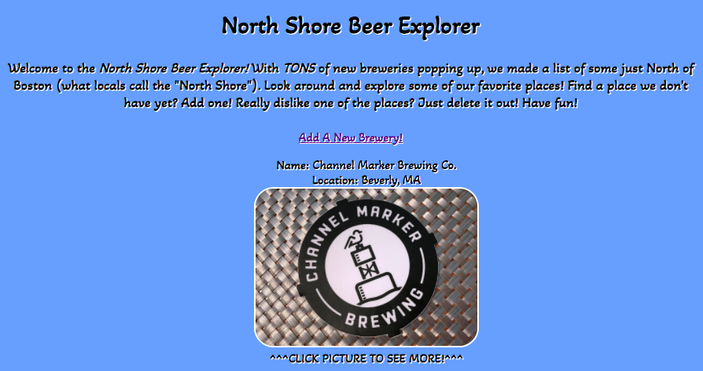
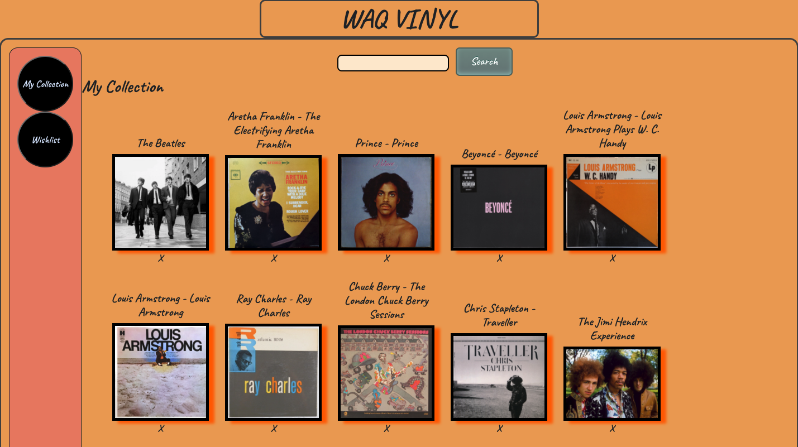
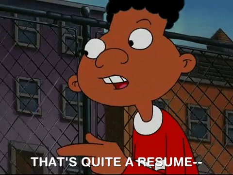

# Arthur 'A.J.' Hutchins - Beverly, MA
## Full-Stack Software Engineer

## Bio: I am a creative-minded Software Engineer with a passion for using empirical data to drive my design and function. My Master’s Degree in Applied Behavior Analysis provides me with a unique behavioral approach that benefits a collaborative environment. I also utilize my background in Education & Financial Business Management to provide quality solutions that improve user functionalities and designs. In my free time, I enjoy playing in my band, golfing, and playing Ultimate (frisbee).

## Software Engineering Projects:
### JEOPARDY:

### North Shore Beer Explorer:

### WAQ Vinyl:

## Resume

