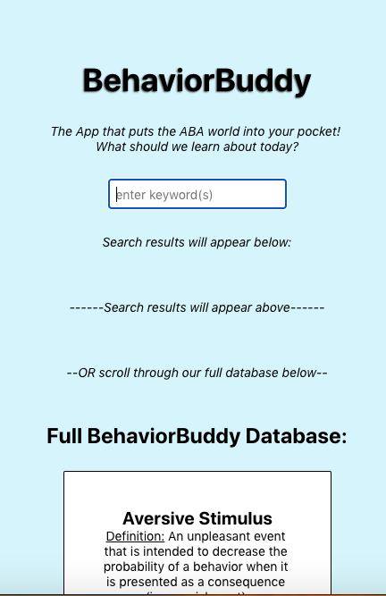

<h1 align="center">
  <ins>Biography</ins>
</h1>
<h2 align="center">
I am a creative-minded Software Engineer with a passion for using empirical data to drive my design and function. My Master’s Degree in Applied Behavior Analysis provides me with a unique behavioral approach that benefits a collaborative environment. I also utilize my background in Education & Financial Business Management to provide quality solutions that improve user functionalities and designs. In my free time, I enjoy playing in my band, golfing, and playing Ultimate (frisbee).
</h2>
 
<h1 align="center" >
  <ins>Projects</ins>
</h1>
<h2 align="center">
Below is a list of my projects, which help exemplify my knowledge of a variety of languages, frameworks, and databases. Explore and enjoy!
</h2>
 
<h1 align="center">
<ins>JEOPARDY</ins>
</h1>
<h2 align="center">
My very first project - made using jQuery, CSS3 & HTML5 - completed in 1-week's time for General Assembly. This is an interactive JEOPARDY application game that users can clone and play on their devices locally. The game utilizes a scoring system and timers so that the user has a limited amount of time to complete as many questions as they can.
</h2>

<h2 align="center">
^^^ CLICK to check out the JEOPARDY GitHub page! ^^^
</h2>
 
<h1 align="center">
<ins>North Shore Beer Explorer</ins>
</h1>
<h2 align="center">
My second project - made using JavaScript, CSS3 & HTML5, utilizing MongoDB, Mongoose, ejs, express.js & methodOverride - completed in 1-week's time for General Assembly. This is an interactive application that is deployed on Heroku for anyone to benefit from. Originally intended for people visiting the 'North Shore' of Massachusetts (just North of Boston), this application has a list of local breweries and their corresponding towns/cities. When a brewery logo is clicked, the user is taken to a more detailed page specific to the selected brewery. This includes a few of the author's favorite beverages at the location, the hours, and the average untappd rating. The user is also able to edit & update each brewery as they see fit, add a new brewery, or delete them altogether.
</h2>

<h2 align="center">
^^^ CLICK to check out the North Shore Beer Explorer! ^^^
</h2>
 
<h1 align="center">
<ins>WAQ Vinyl</ins>
</h1>
<h2 align="center">
My third project (and first group-project) - made using React, RESTful Routes, JavaScript, CSS3, HTML5, utilizing MongoDB, Mongoose, node.js, express.js, bcrypt, cors, dotenv, npm, bootstrap, Heroku, MongoDB Atlas - completed in 1-week's time for General Assembly. This is an application that allows the user to search for albums, add them to a list of owned records in their personal collection, and add to their wishlist. We use a simple crud application that searches the discog API based on the artist and/or album. The search feature returns up to 50 results per search.
</h2>

<h2 align="center">
^^^ CLICK to check out WAQ Vinyl! ^^^
</h2>
 
<h1 align="center">
<ins>BehaviorBuddy</ins>
</h1>
<h2 align="center">
My fourth project - made using React Native, JavaScript, CSS3, HTML5, utilizing MongoDB, Mongoose, node.js, express.js, cors, dotenv, npm, bootstrap, Heroku, MongoDB Atlas - completed in 2-week's time for my final project at General Assembly. This is a mobile application that I am extremely passionate about. Originally intended for parents & teachers of children with special needs, this application contains a customized (and expanding) database of helpful information. Based mostly around Applied Behavior Analysis (ABA), the user can search a keyword/keywords that they are curious about (or just scroll through the database to learn about different things). Results populate and provide a definition, methods/strategies, and resources.
</h2>

<h2 align="center">
^^^ CLICK to check out the BehaviorBuddy GitHub page! ^^^
</h2>
 
<h2 align="center">
<ins>Resume</ins>
</h2>

